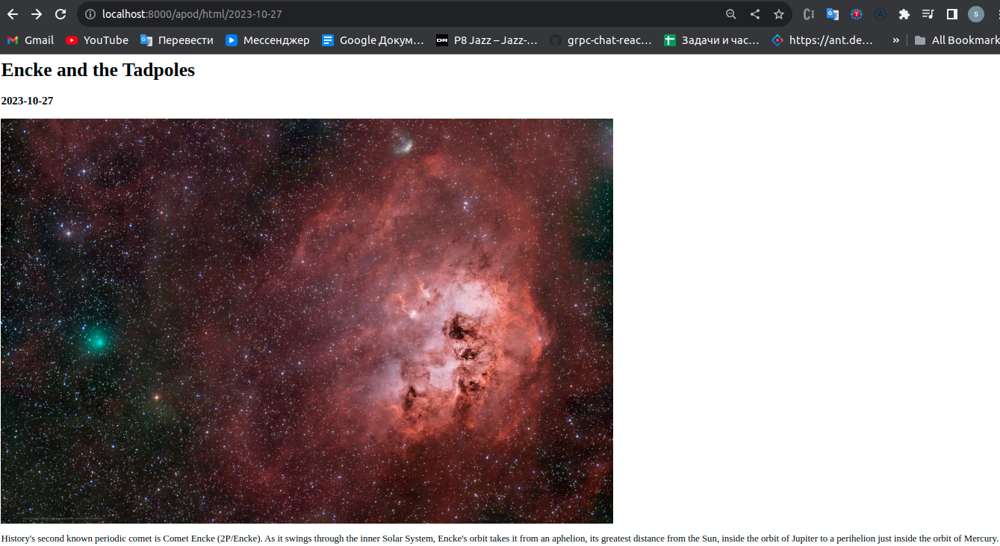

# betera-test-task

* !Before starting, insert your Api Key!*

### routes

- get apod/all - all records
- get apod/{date} - by date (date in format "2023-10-25")

### default ports

- 6001: minio dashboard
- 6555: postgres container
- 8000: http server

### architecture

### go.mod

- go.uber.org/fx - fx is a dependency injection system for Go.
- github.com/ilyakaznacheev/cleanenv - Minimalistic configuration reader
- log/slog - logger
- gorm.io/gorm - for auto migrations and interaction with postgres
- github.com/minio/minio-go/v7 - minio as s3 storage
- github.com/go-chi/chi/v5 - chi as router

### screenshots

- minio dashboard

- apod/{date} route

- apod/all route

- apod/html/{date} route

